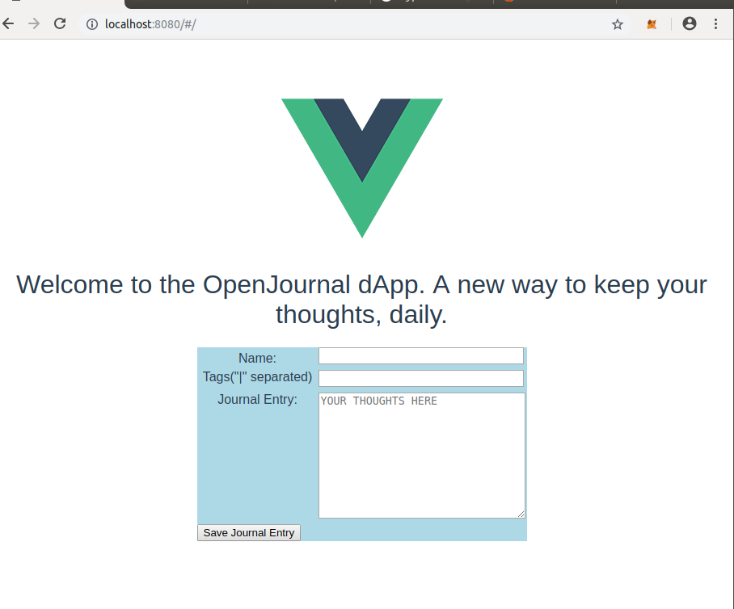

# Open Journal

## Introduction
There are a number of journaling apps on the web today. They range from simple text area types to sofisticated apps with word analysis that can tell the user what she/he felt while writing a daily thought.
Some of them are free and others are not. 

There is a fundamental problem with those apps however. And the problem is privacy. 
Whoever owns the app, owns the content that users write. Even the most honest companies claiming they are not touching user data are still susceptible to hacker attacks that can expose user data at any time. We could generalize this by asserting that once user content leaves user's device, she/he are assumed to be compromised.

While this may not be important for some people who don't mind sharing their data in exchange for freemium services, for others, personal data protection is of highest importance. These people would not mind paying few dollars a month for assurance that their data belongs only to them.

The author of this project tries to solve this problem by using blockchain since that's what it is good at - obfuscating the user data and keeping it on the chain, forever.

## Goals
The goal of this project is to be a proof of concept that authoring on the web can be fairly inexpensive and private.

## Non-Goals
It is a non-goal to show this as a complete solution with complicated business logic.

## Solution
Due to the time constraint, the solution is in the early draft stage that still needs a lot of work putin.

### Setup
The project is setup to be run locally.

Once the project is cloned make sure ganache and truffle are installed.

In separate tabs of terminal window run the following steps:
* run ```ganache-cli```. Note that port is 8545. Copy the seed phrase.
* run ```truffle deploy```
* run ```npm run dev```

* Open the browser page if it wasn't opened automatically and navigate to http://localhost:8080/#/.

You will be able to see a very simple UI:

* Open Metamask extension and use the seed saved earlier to restore your accounts from ganache into Metamask. Make sure the network  is private and is listening on port 8545

Due to the lack of time I wasn't able to dive into intricacies of Vue framework and didn't use it as expected, including having akward UI and reliance on aler window and console messages.


### Known Issues
1. String in from the body is being cutoff durring the transfer, for some reason. Need to investigate why that is. The test is passing in Solidity JS tests so the issue is most likely on the front-end.
2. 
3. 
